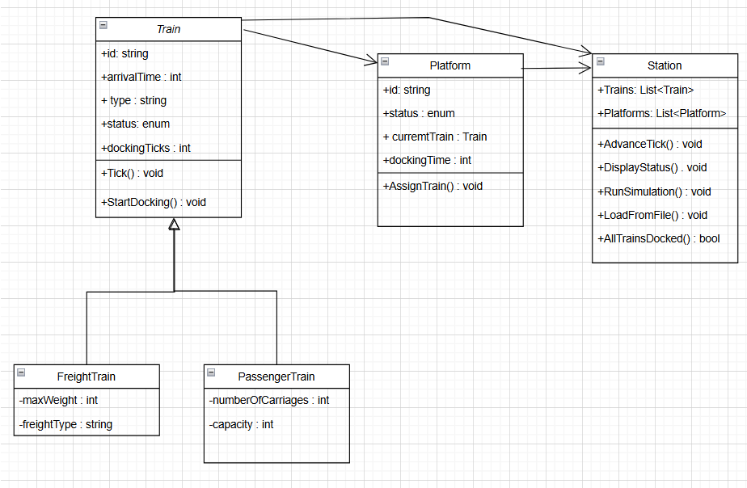

**Practical Work I - Object-Oriented Programming**

**Train Station**

**Student ID:** 9206124

# Contenido
[Introduction	2](#_toc201086254)

[Description	2](#_toc201086255)

[General Description	2](#_toc201086256)

[Design Decisions	2](#_toc201086257)

[Class Diagram	3](#_toc201086258)

[Problems Faced	4](#_toc201086259)

[Conclusions	4](#_toc201086260)

## Introduction
**Student Name:** Hugo Losada Cabeza
**Project Title:** Train Station Simulation System

This document explains a thorough summary of the evolution of a train station simulation project built on Net Core 8.0. It clarifies the applied object-oriented design, the functional implementation, development-related problems, and last results.

This work aims mostly to replicate the management of train arrivals and platform assignments inside a train station. Emphasizing object-oriented programming's principles including encapsulation, inheritance, and polymorphism, the project It gives an interactive command-line simulation where the user may manually define the number of platforms and control the simulation flow. By loading a list of predefined trains from a CSV file, the system handles their status updates across various states: EnRoute, Waiting, Docking, and Docked.

## Description
### General Description
The goal of this project is to simulate the arrival and docking process of trains in a station with a limited number of platforms. Each simulation tick represents 15 minutes of simulated time. Trains arrive based on predefined schedules, attempt to dock when a platform is free, and stay in the docking state for 2 ticks before becoming fully docked. The simulation ends when all trains are docked.

The program reads train data from a CSV file and supports both freight and passenger trains, each with their own unique data. The user is prompted to enter the number of platforms, after which they can start the simulation step-by-step or exit.

### Design Decisions
- The simulation follows a tick-based model, where each tick represents 15 minutes.
- Trains are represented using an abstract class Train, with derived classes PassengerTrain and FreightTrain.
- Platforms are modeled with a Platform class which manages docking status and assigned trains.
- The Station class has the entire simulation, storing lists of Train and Platform objects.
- TrainStatus and PlatformStatus enums are used for clean state tracking.
- Platform assignment logic is done every tick, including re-checking for waiting trains.
- File I/O reads trains from a structured CSV file (Trains.csv).

### Class Diagram

## Problems Faced
- Handling docking logic without previously freeing platforms was tricky.
- Ensuring correct status updates between EnRoute, Waiting, Docking, and Docked.
- Avoiding duplicated logic for docking time countdown (between Train.Tick() and platform handling).
- Parsing errors and format mismatches in the CSV file.
- Making the simulation advance manually while still reflecting proper train behavior.

## Conclusions
This project has provided a valuable opportunity to put object-oriented programming principles into practice in a meaningful and challenging way. Through building a functioning simulation, I gained experience in designing class hierarchies, managing state transitions, git and github implementation and implementing real-time logic in a clean and maintainable structure.

I learned the importance of planning class interactions early, clearly separating responsibilities across classes, and thoroughly testing small behaviors to ensure system-wide verification. The simulation logic required careful attention to timing, resource management, and status updates, all of which mirror real-world software challenges.

The final solution is a functional, extensible system that meets all the project goals. For future improvements, this simulation could be enhanced with a GUI interface, scheduling optimizations, or visual logs of each train's journey. Overall, the work reinforces that solid design and iterative debugging lead to reliable and scalable applications.

